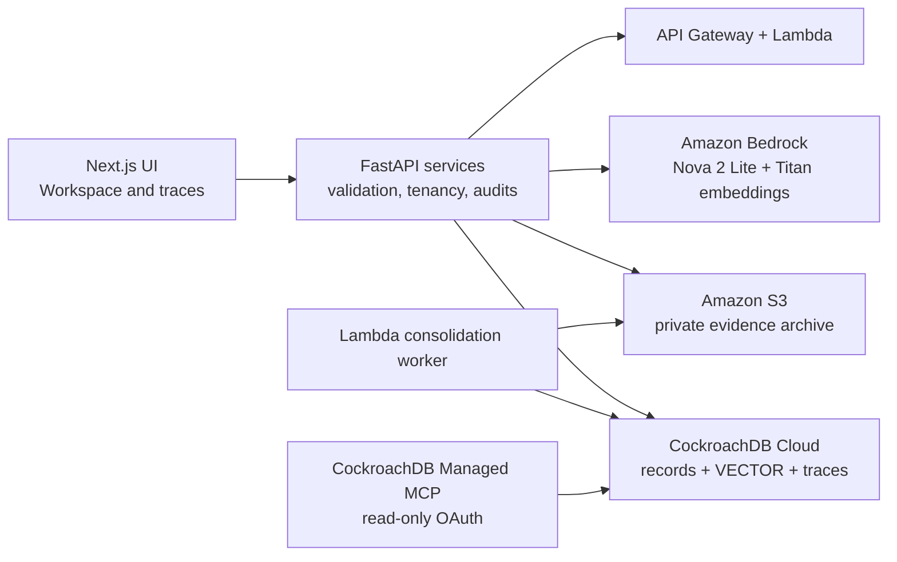
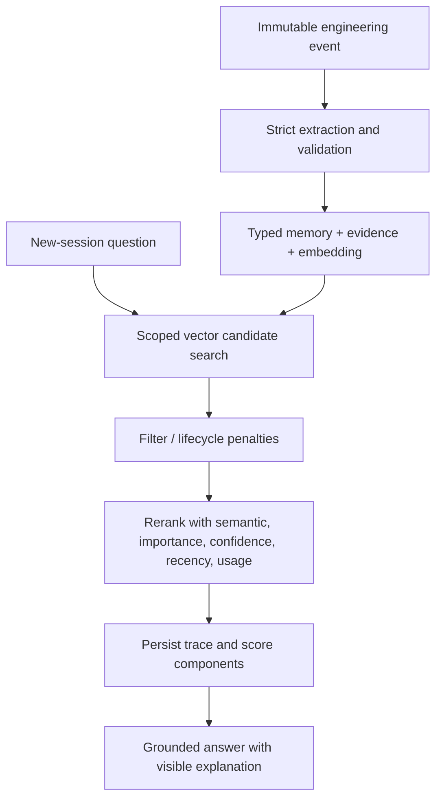

# Engram

> **AI coding agents generate solutions. Engram remembers what the engineering team learned.**

Engram is a persistent memory operating system for engineering agents. It stores decisions, incidents, rejected approaches, successful fixes, constraints, provenance, and retrieval traces—then retrieves only relevant, current knowledge in a new session.

## Why it matters

Ordinary assistants treat memory as extra chat history. Engram treats it as governed production data: typed, tenant-scoped, evidence-backed, semantically searchable, scored transparently, superseded explicitly, consolidated safely, and archived without erasing history.

## What works

- FastAPI API with projects, sessions, events, memories, retrieval, messages, supersession, dispute, dashboard, and consolidation routes.
- Deterministic structured extraction and embeddings for a credential-free offline demo.
- CockroachDB-compatible normalized model with UUID keys, provenance, relations, audits, traces, and consolidation jobs.
- Transparent hybrid scoring and status-aware eligibility with complete persisted trace.
- New-session grounded answers that cite prior project memory.
- Consolidation preview/apply with idempotency and provenance-preserving merged status.
- Local/S3 archive adapters and a Lambda-compatible worker.
- Next.js product UI: Overview, Workspace, Memory Trace, Explorer, Timeline, Consolidation, Architecture, and MCP Inspector.
- Repeatable Acme Commerce seed/reset and smoke flow.

## Architecture

```text
Browser / Next.js → FastAPI domain services → Bedrock adapter
                                  ↓
                 CockroachDB records + VECTOR index
                                  ↓
                       Lambda → S3 evidence archive
```

Mock mode replaces Bedrock with deterministic providers, CockroachDB with SQLite compatibility, and S3 with `local-archive/`. Business logic remains shared. See [architecture](docs/architecture.md) and [memory model](docs/memory-model.md).

### System design



### Retrieval and governance flow



The default retrieval score uses semantic similarity (55%), importance (18%), confidence (12%), recency (10%), and usage (5%), then applies lifecycle status rules. Superseded and disputed records remain available for audit but lose priority.

## Technologies enabled

| Layer | Technology | Purpose |
| --- | --- | --- |
| Web | Next.js App Router, TypeScript, Tailwind CSS | User interface and trace exploration. |
| API | Python 3.12, FastAPI, Pydantic, SQLAlchemy, Alembic | Tenancy-scoped domain services, validation, and migrations. |
| Memory | CockroachDB Cloud, `VECTOR`, distributed vector index | Transactional memory, embeddings, lifecycle, relations, and audits. |
| Models | Amazon Bedrock | Nova 2 Lite for live extraction/answers and Titan Text Embeddings V2 for 1,024-dimensional vectors. |
| Compute | AWS Lambda, Mangum, API Gateway | Serverless API and consolidation worker. |
| Storage | Amazon S3 | Encrypted, versioned evidence archive. |
| Hosting | AWS Amplify | Public Next.js web application. |
| Agent tooling | CockroachDB Cloud Managed MCP | Read-only OAuth inspection of schema, index state, and traces. |
| Local mode | SQLite and deterministic adapters | Full repeatable demo without paid services. |

## Quick start: mock mode

Python 3.12 and Node 20+ are required.

```bash
python -m venv .venv
.venv/Scripts/activate          # Windows
python -m pip install -e ".[dev]"
python scripts/seed_demo.py
python -m uvicorn services.api.app.main:app --reload
```

In another terminal:

```bash
corepack enable
pnpm --dir apps/web install
pnpm --dir apps/web dev
```

Open `http://localhost:3000`; API docs are at `http://localhost:8000/docs`.

Reset or verify the exact demo:

```bash
python scripts/reset_demo.py
python scripts/smoke_demo.py
```

## Live CockroachDB and AWS mode

1. Create a CockroachDB Cloud Standard cluster in AWS `us-west-2`, database `engram`, and least-privilege application user `engram_app`.
2. Copy `.env.example` to `.env`, set `ENGRAM_MODE=live`, and place the TLS CockroachDB `DATABASE_URL` only in that untracked file. URL-encode special characters in the password.
3. Run `alembic upgrade head`. In the CockroachDB SQL shell, run the cluster setting and `CREATE VECTOR INDEX` commands from `infrastructure/cockroach/bootstrap.sql` separately; the feature setting cannot run in the migration transaction.
4. Configure CockroachDB Cloud Managed MCP with the console-generated OAuth connection and choose read-only consent. Never put a database password in MCP configuration.
5. In Bedrock `us-west-2`, choose the serverless Global Amazon Nova 2 Lite profile and enable Titan Text Embeddings V2. The deployment defaults to `global.amazon.nova-2-lite-v1:0` and `amazon.titan-embed-text-v2:0`.
6. Use AWS CloudShell to build and deploy the SAM stack:

```bash
git clone https://github.com/hemalekamohanram/Memory.git
cd Memory
sam build --template-file infrastructure/aws/template.yaml
sam deploy --guided
```

Use `engram-hackathon` as the stack name, enter the database URL only into the no-echo `DatabaseUrlParameter` prompt, and keep the default Bedrock model. The stack creates API Gateway, two Lambdas, and an encrypted versioned S3 bucket.

7. Deploy `apps/web` on AWS Amplify from the `main` branch. Set `NEXT_PUBLIC_API_URL` to the API Gateway `ApiUrl` output. After Amplify gives you its HTTPS URL, redeploy SAM with that value as `WebOrigin` to restrict browser CORS.

See the complete [production deployment guide](docs/production-deployment.md), including cost controls, shutdown, verification, and production hardening boundaries.

Never place credentials in committed files. Live provider completion and cloud deployment require external accounts and are intentionally not exercised by default tests.

## CockroachDB features

- `VECTOR` embeddings reside with structured memory and tenant metadata.
- A filtered vector index accelerates active-memory cosine search in live mode.
- Transactional access updates and persisted candidates make retrieval auditable.
- Managed MCP setup gives Codex/Claude/Cursor safe, read-only schema and trace inspection. See [MCP setup](docs/mcp-setup.md).

## Memory lifecycle and retrieval

Events are immutable evidence. Validated candidates become episodic or semantic memories. Queries create embeddings, obtain 15–25 scoped candidates, exclude expired/merged records, penalize disputed/superseded records, and rerank using configurable vector (55%), importance (18%), confidence (12%), recency (10%), and usage (5%) weights. Selected context and every score are stored before the response. Consolidation creates canonical knowledge while marking originals rather than deleting them.

## Security and reliability

Tenant scoping, bounded inputs, parameterized SQL, strict schemas, request IDs, audit writes, evidence hashes, prompt-injection boundaries, idempotency, and recoverable archive states are core design constraints. See [security](docs/security.md).

## Test and build

```bash
python -m pytest
python -m ruff check services scripts tests
python -m mypy services/api/app
pnpm --dir apps/web lint
pnpm --dir apps/web test
pnpm --dir apps/web build
```

## Demo and submission

- [Three-minute demo](docs/demo-script.md)
- [Devpost draft](docs/devpost-submission.md)
- [Devpost-ready submission copy](docs/submission-copy.md)
- [Production deployment guide](docs/production-deployment.md)
- [Hackathon checklist](docs/hackathon-submission-checklist.md)
- [Hackathon slide deck](docs/engram-hackathon-deck.pptx)
- [Implementation plan](docs/implementation-plan.md)

## Credential-gated integrations and roadmap

Mock mode is fully operational and computes similarity in the service so it can run without cloud resources. Live mode is implemented with native CockroachDB `VECTOR` columns and cosine ANN ordering, Alembic migrations, Bedrock Converse/tool schemas, Titan Text Embeddings V2, S3 encryption, and the Lambda worker. Those cloud paths require the operator's CockroachDB and AWS credentials and are not represented as connected until `/ready` succeeds against those services.

The next production milestones are external identity-provider integration, load testing with a large corpus, managed observability export, and multi-region recovery exercises.

MIT licensed.
